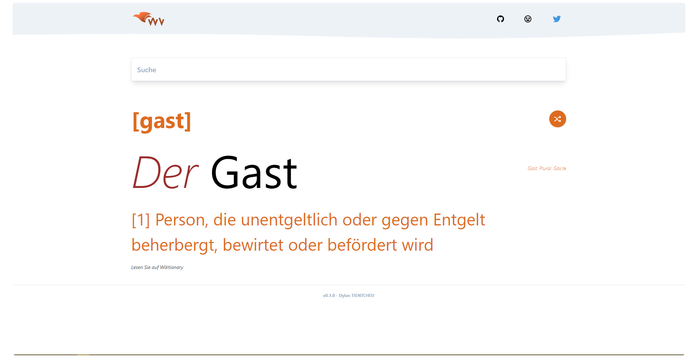

  
   
  <h1><a href="https://v-worter.dylan-tientcheu.now.sh/">Wörter Vogel</a></h1>
  

   A minimalistic open-source German dictionary. Able to give you minimal words description with articles, genre, phonetics and pronunciation syllables.
  

  

   Ein minimales Open-Source-Deutsches Wörterbuch. Es ist in der Lage, Ihnen eine safte Wortbeschreibung mit Artikeln, Genre, Phonetik und Aussprache Silben zu geben.
  

     

  Built with ❤︎ by
    <a href="https://github.com/blurdylan">blurdylan</a>
  

---

**Demo: [https://v-worter.dylan-tientcheu.now.sh/](https://v-worter.dylan-tientcheu.now.sh/)**

   
  
   

### Features :sparkles:

🎈: **Lightweight**: Crafted with minimalistic UI design

⚡: **PWA**: Progressive web app stack

- Fast, light, clean, minimal & responsive

## Demo 🚀

[Worter Vogel](https://v-worter.dylan-tientcheu.now.sh/)

## Usage 💡

1. Search a word and press enter
2. Tap the shuffle button to get a random word

You're done!

## Built with 🔧

- [React](http://reactjs.org/) - Learning purpose.
- JSX
- CSS
- JavaScript
- [Wiktionary API](https://de.wiktionary.org/) - To get the words and information.
- [now](https://zeit.co/) - Deploys like a boss.

## Developing 👷

1. [Clone this repo](https://help.github.com/en/articles/cloning-a-repository) with git.
1. Install dependencies by running `npm install` within the directory that you cloned (probably `worter-vogel`).
1. Start the development server with `npm run dev`.
1. Open development site by going to [http://localhost:3000](http://localhost:3000) in your browser.

## Contributing

Contributions are what make the open source community such an amazing place to be learn, inspire, and create. Any contributions you make are **greatly appreciated**.

1. Fork the Project
2. Create your Feature Branch (`git checkout -b feature/AmazingFeature`)
3. Commit your Changes (`git commit -m 'Add some AmazingFeature`)
4. Push to the Branch (`git push origin feature/AmazingFeature`)
5. Open a Pull Request

## License

Distributed under the MIT License. See `LICENSE` for more information.
